<div align="center">

<!-- Verified image endpoints (HTTP 200) before commit. github-readme-stats.vercel.app currently returns 503 DEPLOYMENT_PAUSED; using github-readme-stats-sigma-five mirror for stats cards until upstream is available again. -->



<br/>


<br/>

<a href="https://platinum-ai.co"></a>
<a href="https://www.linkedin.com/in/fadwa-aljaoui"></a>


<br/>


<br/>

```
Discover ? Audit (WCAG 2.1 AA) ? Design System ? Ship (Next.js) ? Measure ? Compound
```

<br/>

### Featured systems

<table>
<tr valign="top">
<td width="50%">

<h3>&#129302; Platinum AI</h3>
<p><b>Autonomous-grade marketing surfaces.</b></p>
<p>Precision layouts, cinematic motion where it earns its keep, and instrumentation that proves what shipped.</p>
<p>


</p>

</td>
<td width="50%">

<h3>&#9855; Accessibility audit system</h3>
<p><b>Evidence-backed WCAG programs.</b></p>
<p>Repeatable axe + Lighthouse pipelines, human review on critical journeys, and client-ready reporting.</p>
<p>


</p>

</td>
</tr>
<tr valign="top">
<td width="50%">

<h3>&#127968; Real estate visualization lab</h3>
<p><b>Spatial clarity on the web.</b></p>
<p>WebGL-first scenes with disciplined performance budgets so listings feel tangible, not gimmicky.</p>
<p>


</p>

</td>
<td width="50%">

<h3>&#127973; MedTech UX systems</h3>
<p><b>Clinical-grade interaction design.</b></p>
<p>ARIA-first components, predictable keyboard flows, and documentation your compliance team can defend.</p>
<p>


</p>

</td>
</tr>
</table>

<br/>

### Toolchain


<br/>

### Signals

<!-- Stats mirror verified 200 while github-readme-stats.vercel.app is paused (503). -->

<table>
<tr>
<td align="center"></td>
<td align="center"></td>
</tr>
<tr>
<td colspan="2" align="center"></td>
</tr>
<tr>
<td colspan="2" align="center"></td>
</tr>
</table>

<!-- Run .github/workflows/snake.yml once so the output branch exists; until then the SVG sources below may 404 and the fallback image will display. -->

### Contribution lattice

<picture>
  <source media="(prefers-color-scheme: dark)" srcset="https://raw.githubusercontent.com/successfulfadwa/successfulfadwa/output/github-contribution-grid-snake-dark.svg" />
  <source media="(prefers-color-scheme: light)" srcset="https://raw.githubusercontent.com/successfulfadwa/successfulfadwa/output/github-contribution-grid-snake.svg" />
  
</picture>

<br/>

### Connect

<table>
<tr>
<th align="center">Website</th>
<th align="center">LinkedIn</th>
<th align="center">Email</th>
<th align="center">Calendar</th>
</tr>
<tr>
<td align="center"><a href="https://platinum-ai.co">platinum-ai.co</a></td>
<td align="center"><a href="https://www.linkedin.com/in/fadwa-aljaoui">fadwa-aljaoui</a></td>
<td align="center"><a href="mailto:hello@aljaoui.com">hello@aljaoui.com</a></td>
<td align="center"><a href="https://platinum-ai.co">Book a call</a></td>
</tr>
</table>

<br/>

<a href="https://platinum-ai.co"></a>
<a href="https://platinum-ai.co"></a>

<br/><br/>


<sub>Copyright ù 2026 PlatinumAI. All rights reserved.</sub>

</div>
