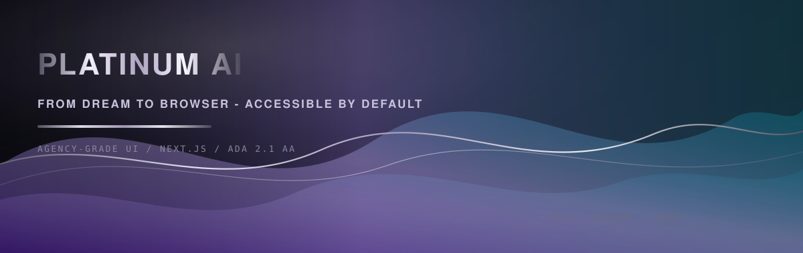

  

  

  

  

 

  <a href="https://www.Aljaoui.com"><strong>Interactive lab</strong></a>
  &nbsp;·&nbsp;
  <a href="https://github.com/successfulfadwa?tab=repositories"><strong>Repositories</strong></a>
  &nbsp;·&nbsp;
  <a href="https://www.linkedin.com/in/successfulfadwa"><strong>LinkedIn</strong></a>

 

  

<strong>Scalable SVG</strong> (same animation, crisp on retina)

  

  Snake motion is decorative. Prefer less motion? Use your OS “Reduce motion” setting and skip autoplaying assets elsewhere on the web.

  <a href="https://github.com/successfulfadwa/successfulfadwa/actions/workflows/snake.yml">Regenerate snake</a>
  ·
  <a href="https://www.Aljaoui.com">Full interactive experience ?</a>

 

  <code>Discover ? Audit (WCAG 2.1 AA) ? Design system ? Ship (Next.js) ? Measure</code>

<strong>What I build</strong>

- **Profile & marketing sites** with disciplined typography, motion that respects `prefers-reduced-motion`, and components you can maintain.
- **Accessibility remediation** on existing React / Next.js codebases, not just checkbox audits.
- **Performance and clarity** so your practice or brand reads as premium the first second someone lands on the page.

<strong>Stack</strong>

| Layer        | Tools |
| ------------ | ----- |
| UI           | React, Next.js, TypeScript, Tailwind CSS |
| Quality      | ESLint, accessible patterns, semantic HTML |
| Beyond the web | C# where the product needs it |

<strong>Featured work</strong> <em>(pin these on your profile)</em>

| Repo | Idea |
| ---- | ---- |
| [`successfulfadwa.github.io`](https://github.com/successfulfadwa/successfulfadwa.github.io) | Personal / portfolio surface on GitHub Pages |
| [`FilmLand1`](https://github.com/successfulfadwa/FilmLand1) | Front-end storytelling experiments |
| [`so_long-42-school`](https://github.com/successfulfadwa/so_long-42-school) | Game / graphics foundations from 42 |
| [`Mlnitalk`](https://github.com/successfulfadwa/Mlnitalk) | Low-level C exploration |

Replace names if your pins differ — this table is a curated menu, not auto-synced to GitHub pins.

<strong>How to use this folder as your GitHub profile README</strong>

1. Create a **public** repository named **`successfulfadwa`** (must match your GitHub username exactly).
2. Copy everything from this project into that repo (keep `README.md` at the root).
3. Enable **Actions** for the repo, open **Generate contribution snake**, click **Run workflow** once so `assets/github-snake.svg` and `assets/github-snake.gif` are replaced with your real grid animation (a tiny placeholder GIF ships so the image is never broken before the first run).
4. If your username is not `successfulfadwa`, change it in **README links**, the **komarev** `username=` query, and the **LinkedIn** URL. The workflow already uses `github.repository_owner` for the grid.
5. Set your GitHub profile **Featured** repositories to match the table above if you want parity between pins and copy.

---

  Platinum AI · DFW · audits + builds · void · chrome · glow

